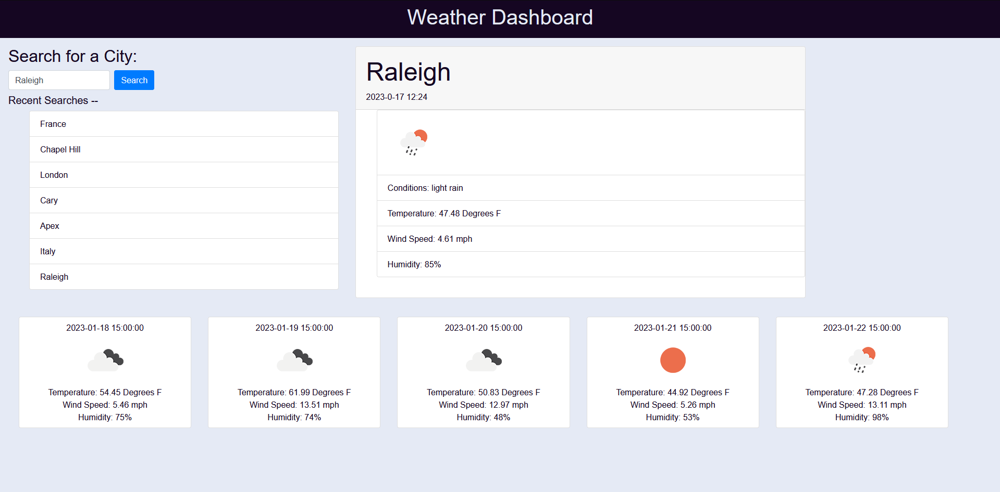

# Weather-Dashboard

## Description

This project is weather dashboard that can be used to find the current and future weather of a city.  The page welcomes you with a search bar, and upon user entry pulls the weather and 5 day forecast from the Open Weather Map API. The motivation behind this project was to practice using API's, as well as more practice on using localStorage and manipulating the DOM. I learned a lot about fetching API's and how to tie their data to the DOM.

## Installation

N/A

## Usage

Open the index.html file in a browser, or navigate to https://veis1337.github.io/Interactive-Schedule.html
Click on a time block and type in whatever event you want saved for that slot, and click the save button next to it!  The event will be saved so that you can revisit the page and still have it appear.  

## Credits

https://www.w3schools.com/ -- For teaching me so much about things. 
https://www.openweathermap.org/ -- For their API

## License

MIT © Michael Weiss

Pages link
https://veis1337.github.io/Weather-Dashboard/
Repo link
https://github.com/Veis1337/Weather-Dashboard
